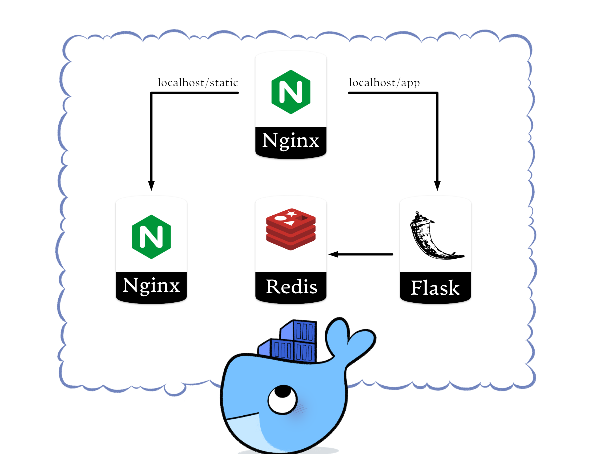

# Docker composer using Nginx, Flask, and Redis



This is a Docker Composer project that use reverse proxy to launch two webpage links: /static and /app.

## Overview

This Docker Compose configuration lets you run easily Nginx, Redis, Python Flask and Composer.
It exposes 5 services:

- reverse proxy (Nginx)
- /static (Nginx)
- /app (Flask)
- db (redis)
- composer

## Getting Started

These instructions will cover usage information and for the docker container

### Prerequisities

In order to run this container you'll need docker installed.

- [Windows](https://docs.docker.com/windows/started)
- [OS X](https://docs.docker.com/mac/started/)
- [Linux](https://docs.docker.com/linux/started/)

### Clone this code

```sh
git clone https://github.com/Bramba7/docker.git
cd ~/docker/compose-nginx-redis-flask
```

### Run docker composer containers

```sh
docker-composer up
```

### Destroy docker composer containers

```sh
docker-composer down
```
